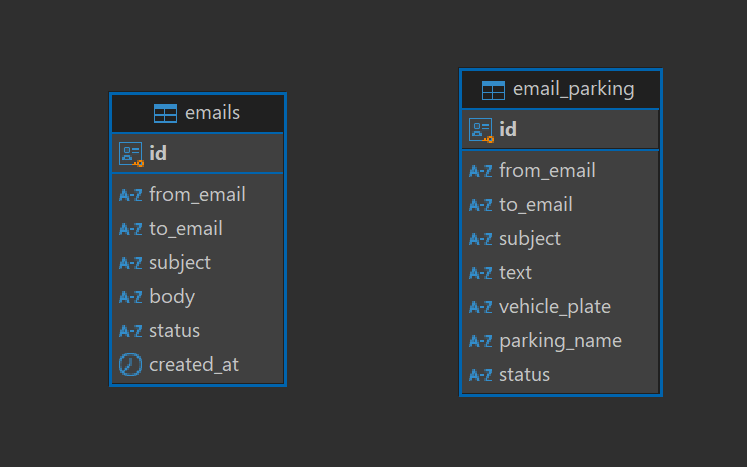

# MICROSERVICE EMAIL

## Descripción

El Microservicio de Emails es responsable de simular el envío de correos electrónicos a los socios cuando un vehículo
es registrado en un parqueadero. Utiliza RabbitMQ para recibir mensajes de otros microservicios y procesar las
solicitudes de envío de correo.

### Funcionalidades Principales
- Simulación de envío de correos electrónicos.
- Procesamiento de mensajes a través de RabbitMQ.
- Log de las solicitudes de envío de correo.

### Tecnologías Utilizadas
- Java 17
- Spring Boot
- PostgreSQL
- RabbitMq

### ER - Microservicio usuarios
<div style="align-items: center">
    
</div>

### Endpoints de la API

Para obtener más información sobre los endpoints disponibles, consulta la documentación de la API.
Puedes importar la [colección de Postman](../Parking%20Backend.postman_collection.json)
o acceder a la documentación de Swagger [http://localhost:8082/swagger-ui/index.html](http://localhost:8080/swagger-ui/index.html)


### Generate Jar

Generamos el jar de cada microservicio, [aquí](../user-ms/README.md#Generate-Jar) un ejemplo:

### Variables de entorno

Crear un archivo .env siguiendo el ejemplo -> [sample.env](sample.env)

(Tanto en rabbit o postgres en vez de localhost colocar 'postgres' o 'rabbitmq')


```bash
POSTGRES_USER=postgresUserSample
POSTGRES_PASSWORD=postgresPasswordSample
POSTGRES_URI=postgresUriSample

JWT_SECRET=jwtSecretSample
JWT_EXPIRE_TIME=jwtExpireSample

SERVICE_EMAIL=email@sample.com

RABBIT_HOST=rabbitHostSample
RABBIT_PORT=rabbitPortSample
RABBIT_USER=rabbitUserSample
RABBIT_PASSWORD=rabbitPasswordSample
```


