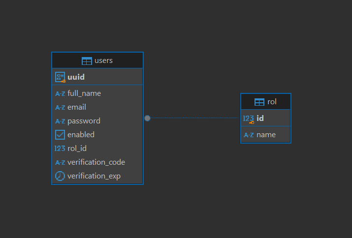
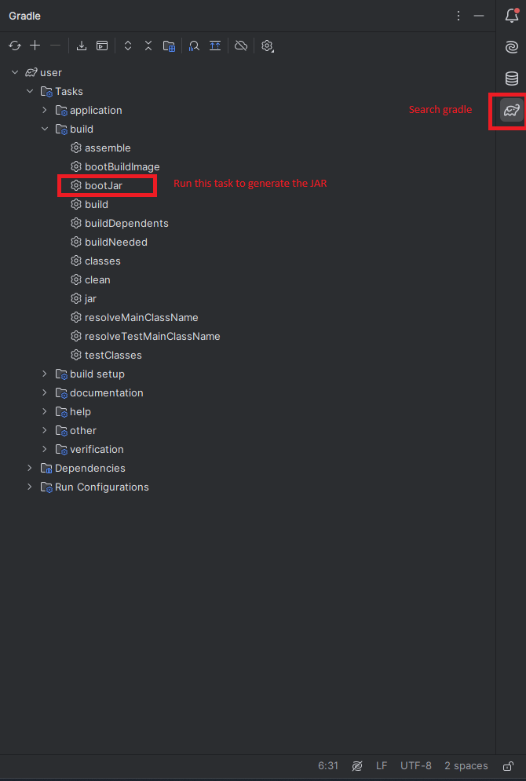

# MICROSERVICE USERS

## Descripción

El Microservicio de Usuarios es responsable de la autenticación, autorización y gestión de los usuarios dentro del 
sistema de parqueaderos. Este microservicio maneja el inicio de sesión y la creación de usuarios con diferentes roles, 
específicamente el Administrador, Socio y User.

### Funcionalidades Principales
- Autenticación de usuarios mediante JWT.
- Registro de nuevos usuarios (solo para Administradores).
- Gestión de roles de usuarios.
- Protección de endpoints según roles y autenticación JWT.
- Token de autenticación con expiración de 6 horas.

### Tecnologías Utilizadas
- Java 17
- Spring Boot 
- PostgreSQL 

### ER - Microservicio usuarios
<div style="align-items: center">
    
</div>

### Endpoints de la API

Para obtener más información sobre los endpoints disponibles, consulta la documentación de la API. 
Puedes importar la [colección de Postman](../Parking%20Backend.postman_collection.json) 
o acceder a la documentación de Swagger [http://localhost:8080/swagger-ui/index.html](http://localhost:8080/swagger-ui/index.html)


### Generate Jar

Generamos el jar de cada microservicio, aquí un ejemplo:

El jar quedará en .../build/libs/user-0.0.1-SNAPSHOT.jar
<div style="align-items: center">
    
</div>

### Variables de entorno

Crear un archivo .env siguiendo el ejemplo -> [sample.env](sample.env) 

```bash
POSTGRES_USER=postgresUserSample
POSTGRES_PASSWORD=postgresPasswordSample
POSTGRES_URI=postgresUriSample

JWT_SECRET=jwtSecretSample
JWT_EXPIRE_TIME=jwtExpireSample

SERVICE_EMAIL=email@sample.com

RABBIT_HOST=rabbitHostSample
RABBIT_PORT=rabbitPortSample
RABBIT_USER=rabbitUserSample
RABBIT_PASSWORD=rabbitPasswordSample
```


